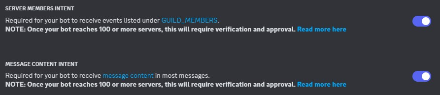

# ⚙️ Konfiguration - Einrichtung

Diese Anleitung führt dich durch die vollständige Einrichtung des ClansCore-Systems.

ClansCore besteht aus drei Hauptkomponenten:

- **clanscore-api**: Node.js/Express REST API für Backend-Logik
- **dashboard**: Angular Frontend für Administratoren
- **discord-bot**: Discord-Bot für Vereinsmitglieder

---

## Voraussetzungen

Nach dieser Anleitung sollten die nachfolgenden Voraussetzungen erfüllt sein.

### Für lokale Entwicklung

- Node.js 20+ installiert
- MongoDB lokal installiert (oder Docker)
- Git Repository geklont
- Discord Bot Token und Client ID

### Für Production-Deployment

- Docker & Docker Compose installiert
- Server mit mindestens 2GB RAM
- Git Repository geklont

---

## Schnellstart-Einrichtung

### 1. Repository klonen

```bash
git clone https://github.com/ClansCore/clanscore.git
cd clanscore
```

### 2. Umgebungs-Variablen konfigurieren

**Für lokale Entwicklung:**

```bash
cp .env.example .env
nano .env  # Alle Werte anpassen
```

Siehe [Umgebungs-Variablen Mapping](secrets-env/env-mapping.md)

**Für Production:**

Verwende GitHub Secrets (siehe [GitHub Secrets Guide](secrets-env/github-secrets.md))

### 3. Dependencies installieren

```bash
npm install
npm run build:shared
```

### 4. Services starten

**Lokal (ohne Docker):**
```bash
# Terminal 1: API
npm run dev:api

# Terminal 2: Discord Bot
npm run dev:bot

# Terminal 3: Dashboard
npm run dev:dashboard
```

**Mit Docker:**
```bash
docker-compose up -d --build
```

---

## Erforderliche Konfigurationen

### Discord Bot Setup

1. **Discord Application erstellen:**
      - Gehe zu: https://discord.com/developers/applications
      - Erstelle eine neue Application
      - Kopiere `DISCORD_TOKEN` und `DISCORD_CLIENT_ID` für die Umgebungs-Variablen oder GitHub Secrets

2. **Bot → Privileged Gateway Intents**:
      - Aktiviere "Server Members Intent"
      - Aktiviere "Message Content Intent"



1. **OAuth2 → OAuth2 URL Generator**:
      - Wähle die Scopes: `bot`, `applications.commands`
      - Setze Bot Permissions: `Administrator`, `Manage Roles`, `View Channels`, `Manage Events`, `Create Events`, `Send Messages`, `Manage Messages`
      - Setze den Integration Type auf `Guild Install`, kopiere den generierten Link und lade den Bot auf dein Server ein.


1. **Server ID kopieren:**
      - Rechtsklick auf Discord-Server und "Server ID kopieren" anklicken
      - Das ist die `DISCORD_GUILD_ID` für die Umgebungs-Variablen oder GitHub Secrets

### MongoDB Setup

**Lokal:**

MongoDB Community Edition inkl. MongoDB Compass installieren für einfacheren Zugriff: https://fastdl.mongodb.org/

```bash
# MongoDB im Terminal starten (falls lokal installiert)
mongod

# Oder mit Docker
docker run -d -p 27017:27017 --name mongodb mongo:8
```

**Production:**

- MongoDB wird automatisch mit Docker Compose gestartet
- Konfiguriere `MONGO_INITDB_ROOT_USERNAME` und `MONGO_INITDB_ROOT_PASSWORD` in den Umgebungs-Variablen oder GitHub Secrets

### Google Calendar Setup

Siehe [Kalender-Integrations Guide](./calendar/integration.md).

---

## Erste Schritte nach der Einrichtung

### 1. Discord Server vorbereiten

Bevor der Discord-Bot voll funktionsfähig im Server verwendet werden kann, müssen die notwendigen Channels manuell in Discord erstellt werden.

Diese sind unter `discord-bot\channelNames.ts` definiert.

```
export const ChannelNames = {
    RULES: "regeln",
    EVENTS: "events",
    LEADERBOARDS: "rangliste",
    TASKS: "aufgaben",
    COMMANDS: "bot-befehle",
    APPLICATIONS: "bot-bewerbungen",
    REWARDS: "bot-belohnungen",
    COMPLETED_TASKS: "bot-aufgaben",
    BotLog: "bot-log",
} as const;

export type ChannelName = (typeof ChannelNames)[keyof typeof ChannelNames];
```

| Channel-Name    | Beschreibung |
| --------------- | ------------ |
| regeln          | Regel-Channel mit allen wichtigen Richtlinien zu Verein und Datenschutz der Nutzer. |
| events          | Events-Channel mit Übersicht der nächsten 5 Events inkl. Event-Benachrichtigungen. |
| rangliste       | Ranglisten-Channel mit der Auflistung aller existierenden Ranglisten. |
| aufgaben        | Aufgaben-Channel, in dem die offenen Aufgaben publiziert und beansprucht werden können. |
| bot-befehle     | Befehls-Channel der als zentraler Ort für alle Bot-Befehle genutzt werden kann. |
| bot-bewerbungen | Vorstands-Bereich: Hier werden alle Bewerbungen zur Bearbeitung und auch Austritte angezeigt. |
| bot-belohnungen | Vorstands-Bereich: Hier werden alle angeforderten Belohnungen zur Bearbeitung angezeigt. |
| bot-aufgaben    | Vorstands-Bereich: Hier werden alle erledigten Aufgaben zur Bearbeitung angezeigt. |
| bot-log    | Vorstands-Bereich: Hier werden relevante Änderungen in Discord und Dashboard protokolliert. |

**Wichtiger Hinweis:**

- Der Channel-Bereich "Vorstand" sollte dementsprechend nur für Vorstandsmitglieder sichtbar sein.
- Der Discord-Server sollte grundsätzlich in den Server-Einstellungen stummgeschaltet werden, da ansonsten immer wieder Benachrichtigungen hervorgehoben werden. (Aktualisierung der Event-Übersicht und Ranglisten)


### 2. Bot mit der DB synchronisieren

Führe diese Befehle im Discord-Server aus, um Rollen und User mit der Datenbank zu synchronisieren:

```
/syncroles
/syncusers
```

### 3. Kalender verknüpfen und Event synchronisieren

```
/linkcalendar
/syncevents
```

Siehe [Kalender-Integrations Guide](./calendar/integration.md) für eine vollständige Anleitung.

## Nächste Schritte

- [Architektur](development/architecture.md) - Code-Aufbau verstehen
- [API-Endpunkte](development/api-endpoints.md) - API-Dokumentation
- [Deployment](../deployment/guide.md) - Production-Deployment
- [Dashboard](../dashboard/manual.md) - Dashboard-Funktionen
- [Discord Bot](../bot/manual.md) - Bot-Funktionen

---

## Troubleshooting

- "Missing environment variables"
    - Prüfe, ob alle erforderlichen Variablen in `.env` gesetzt sind
    - Siehe [Umgebungs-Variablen](secrets-env/env-mapping.md) für vollständige Liste

- MongoDB-Verbindungsfehler
    - Prüfe, ob MongoDB läuft: `docker ps` oder `mongosh`
    - Prüfe `MONGO_HOST` und `MONGO_PORT`

- Discord Bot verbindet nicht
    - Prüfe den `DISCORD_TOKEN`
    - Prüfe die Bot-Intents in Discord Developer Console
    - Prüfe die Logs: `docker-compose logs discord-bot`

---

## Weitere Informationen

- [GitHub Secrets](secrets-env/github-secrets.md) - Secrets für Production
- [Umgebungs-Variablen](secrets-env/env-mapping.md) - Alle Variablen erklärt
- [Lokale Entwicklung](../development/local.md) - Entwicklung ohne Docker

---
